# SkillVerse Backend – Tổng hợp các luồng chức năng & Sequence Diagrams

> Ngày tạo: 28/02/2026  
> Source: Toàn bộ controllers trong `src/main/java/com/exe/skillverse_backend/`

---

## Mục lục

1. [Xác thực & Người dùng (Auth & User)](#1-xác-thực--người-dùng)
2. [Đăng ký / Đăng nhập Google OAuth](#2-google-oauth)
3. [Quên mật khẩu / Đặt lại mật khẩu](#3-quên-mật-khẩu)
4. [Premium Subscription](#4-premium-subscription)
5. [Wallet & Thanh toán PayOS](#5-wallet--thanh-toán-payos)
6. [Mentor – Đăng ký & Profile](#6-mentor--đăng-ký--profile)
7. [Mentor Booking (Đặt lịch)](#7-mentor-booking)
8. [AI Chatbot (General & Expert)](#8-ai-chatbot)
9. [AI Roadmap (Career Path)](#9-ai-roadmap)
10. [Study Planner (Kế hoạch học tập)](#10-study-planner)
11. [Task Board (Kanban)](#11-task-board)
12. [Course (Khoá học)](#12-course)
13. [Khóa học – Mua & Enroll](#13-khóa-học--mua--enroll)
14. [Quiz & Codelab](#14-quiz--codelab)
15. [Gamification (Điểm XP, Badges, Leaderboard)](#15-gamification)
16. [Daily Check-in / Streak](#16-daily-check-in--streak)
17. [Community Posts](#17-community-posts)
18. [PreChat (Nhắn tin P2P)](#18-prechat)
19. [Group Chat](#19-group-chat)
20. [Meowl Chat Service](#20-meowl-chat-service)
21. [Family Chat & Parent Service](#21-family-chat--parent-service)
22. [Business Hub (Job Posting, Application)](#22-business-hub)
23. [Seminar (Hội thảo)](#23-seminar)
24. [Portfolio & Recruiter](#24-portfolio--recruiter)
25. [Skin System](#25-skin-system)
26. [Support Ticket](#26-support-ticket)
27. [Violation Report (Báo cáo vi phạm)](#27-violation-report)
28. [Student Learning Report](#28-student-learning-report)
29. [Notification](#29-notification)
30. [Admin – Quản trị tổng hợp](#30-admin)

---

## 1. Xác thực & Người dùng

**Endpoints:** `POST /api/users/register`, `POST /api/auth/verify-email`, `POST /api/auth/resend-otp`, `POST /api/auth/login`, `POST /api/auth/logout`, `POST /api/auth/refresh`, `GET /api/auth/verify`

**Actors:** Client, AuthController, UserRegistrationController, EmailVerificationService, AuthService, DB, EmailServer, JwtService

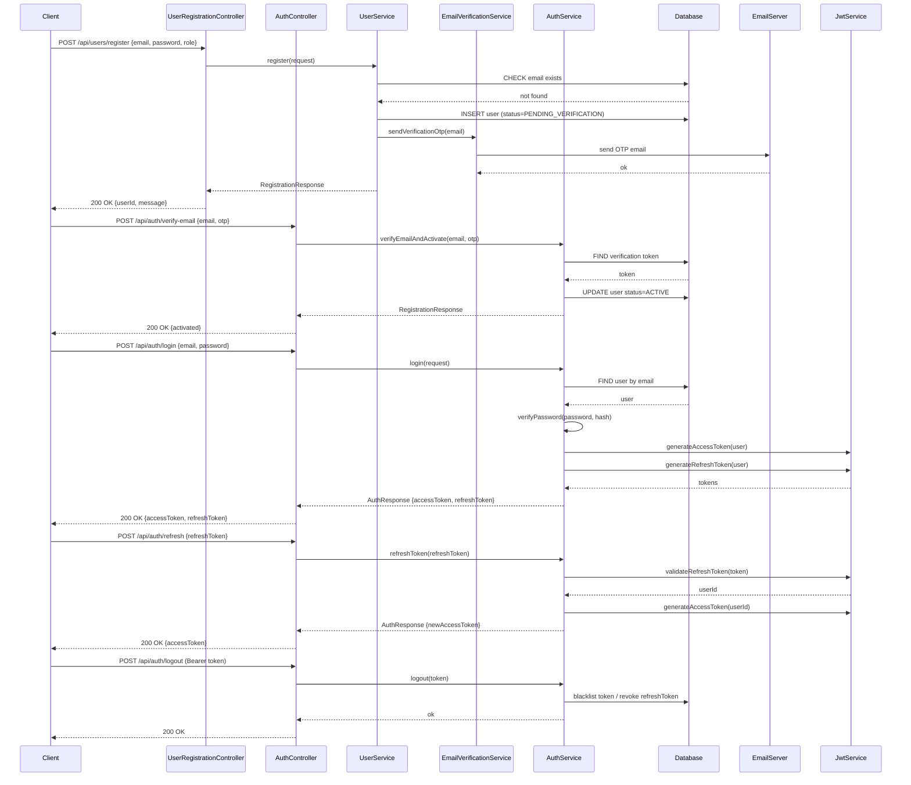
```mermaid
sequenceDiagram
    participant C as Client
    participant UC as UserRegistrationController
    participant AC as AuthController
    participant US as UserService
    participant EVS as EmailVerificationService
    participant AS as AuthService
    participant DB as Database
    participant Mail as EmailServer
    participant JWT as JwtService

    %% -- ĐĂNG KÝ --
    C->>UC: POST /api/users/register {email, password, role}
    UC->>US: register(request)
    US->>DB: CHECK email exists
    DB-->>US: not found
    US->>DB: INSERT user (status=PENDING_VERIFICATION)
    US->>EVS: sendVerificationOtp(email)
    EVS->>Mail: send OTP email
    Mail-->>EVS: ok
    US-->>UC: RegistrationResponse
    UC-->>C: 200 OK {userId, message}

    %% -- XÁC THỰC EMAIL --
    C->>AC: POST /api/auth/verify-email {email, otp}
    AC->>AS: verifyEmailAndActivate(email, otp)
    AS->>DB: FIND verification token
    DB-->>AS: token
    AS->>DB: UPDATE user status=ACTIVE
    AS-->>AC: RegistrationResponse
    AC-->>C: 200 OK {activated}

    %% -- ĐĂNG NHẬP --
    C->>AC: POST /api/auth/login {email, password}
    AC->>AS: login(request)
    AS->>DB: FIND user by email
    DB-->>AS: user
    AS->>AS: verifyPassword(password, hash)
    AS->>JWT: generateAccessToken(user)
    AS->>JWT: generateRefreshToken(user)
    JWT-->>AS: tokens
    AS-->>AC: AuthResponse {accessToken, refreshToken}
    AC-->>C: 200 OK {accessToken, refreshToken}

    %% -- REFRESH TOKEN --
    C->>AC: POST /api/auth/refresh {refreshToken}
    AC->>AS: refreshToken(refreshToken)
    AS->>JWT: validateRefreshToken(token)
    JWT-->>AS: userId
    AS->>JWT: generateAccessToken(userId)
    AS-->>AC: AuthResponse {newAccessToken}
    AC-->>C: 200 OK {accessToken}

    %% -- LOGOUT --
    C->>AC: POST /api/auth/logout (Bearer token)
    AC->>AS: logout(token)
    AS->>DB: blacklist token / revoke refreshToken
    AS-->>AC: ok
    AC-->>C: 200 OK
```

---

## 2. Google OAuth

**Endpoints:** `POST /api/auth/google`, `POST /api/auth/set-password`

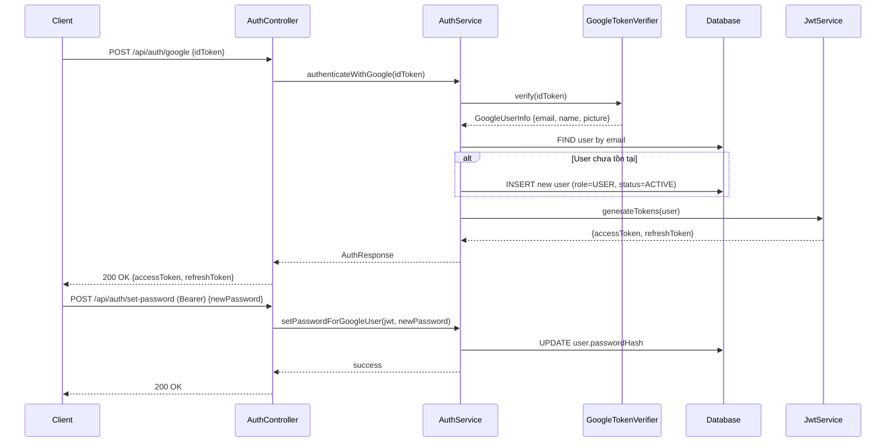
```mermaid
sequenceDiagram
    participant C as Client
    participant AC as AuthController
    participant AS as AuthService
    participant GV as GoogleTokenVerifier
    participant DB as Database
    participant JWT as JwtService

    C->>AC: POST /api/auth/google {idToken}
    AC->>AS: authenticateWithGoogle(idToken)
    AS->>GV: verify(idToken)
    GV-->>AS: GoogleUserInfo {email, name, picture}
    AS->>DB: FIND user by email
    alt User chưa tồn tại
        AS->>DB: INSERT new user (role=USER, status=ACTIVE)
    end
    AS->>JWT: generateTokens(user)
    JWT-->>AS: {accessToken, refreshToken}
    AS-->>AC: AuthResponse
    AC-->>C: 200 OK {accessToken, refreshToken}

    %% Set password cho Google user
    C->>AC: POST /api/auth/set-password (Bearer) {newPassword}
    AC->>AS: setPasswordForGoogleUser(jwt, newPassword)
    AS->>DB: UPDATE user.passwordHash
    AS-->>AC: success
    AC-->>C: 200 OK
```

---

## 3. Quên Mật Khẩu

**Endpoints:** `POST /api/auth/forgot-password`, `POST /api/auth/reset-password`

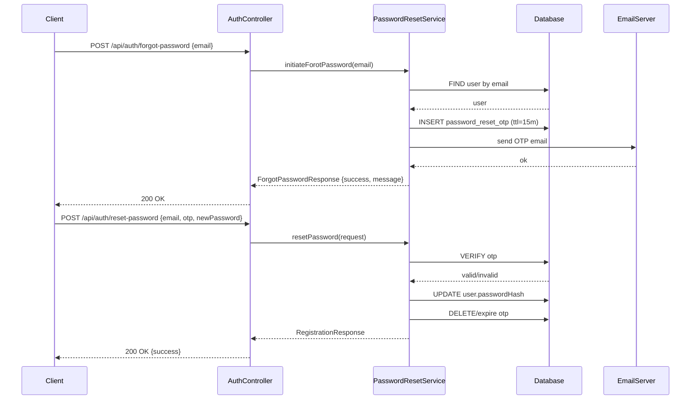
```mermaid
sequenceDiagram
    participant C as Client
    participant AC as AuthController
    participant PRS as PasswordResetService
    participant DB as Database
    participant Mail as EmailServer

    C->>AC: POST /api/auth/forgot-password {email}
    AC->>PRS: initiateForotPassword(email)
    PRS->>DB: FIND user by email
    DB-->>PRS: user
    PRS->>DB: INSERT password_reset_otp (ttl=15m)
    PRS->>Mail: send OTP email
    Mail-->>PRS: ok
    PRS-->>AC: ForgotPasswordResponse {success, message}
    AC-->>C: 200 OK

    C->>AC: POST /api/auth/reset-password {email, otp, newPassword}
    AC->>PRS: resetPassword(request)
    PRS->>DB: VERIFY otp
    DB-->>PRS: valid/invalid
    PRS->>DB: UPDATE user.passwordHash
    PRS->>DB: DELETE/expire otp
    PRS-->>AC: RegistrationResponse
    AC-->>C: 200 OK {success}
```

---

## 4. Premium Subscription

**Endpoints:** `GET /api/premium/plans`, `POST /api/premium/subscribe`, `POST /api/premium/purchase-with-wallet`, `PUT /api/premium/subscription/cancel`, `POST /api/premium/subscription/cancel-with-refund`, `POST /api/premium/subscription/enable-auto-renewal`

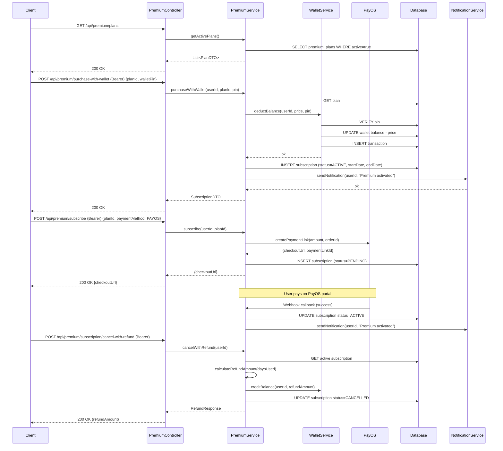
```mermaid
sequenceDiagram
    participant C as Client
    participant PC as PremiumController
    participant PS as PremiumService
    participant WS as WalletService
    participant PayOS as PayOS
    participant DB as Database
    participant NS as NotificationService

    %% Xem plans
    C->>PC: GET /api/premium/plans
    PC->>PS: getActivePlans()
    PS->>DB: SELECT premium_plans WHERE active=true
    PS-->>PC: List<PlanDTO>
    PC-->>C: 200 OK

    %% Mua premium bằng ví
    C->>PC: POST /api/premium/purchase-with-wallet (Bearer) {planId, walletPin}
    PC->>PS: purchaseWithWallet(userId, planId, pin)
    PS->>DB: GET plan
    PS->>WS: deductBalance(userId, price, pin)
    WS->>DB: VERIFY pin
    WS->>DB: UPDATE wallet balance - price
    WS->>DB: INSERT transaction
    WS-->>PS: ok
    PS->>DB: INSERT subscription (status=ACTIVE, startDate, endDate)
    PS->>NS: sendNotification(userId, "Premium activated")
    NS-->>PS: ok
    PS-->>PC: SubscriptionDTO
    PC-->>C: 200 OK

    %% Mua premium qua PayOS
    C->>PC: POST /api/premium/subscribe (Bearer) {planId, paymentMethod=PAYOS}
    PC->>PS: subscribe(userId, planId)
    PS->>PayOS: createPaymentLink(amount, orderId)
    PayOS-->>PS: {checkoutUrl, paymentLinkId}
    PS->>DB: INSERT subscription (status=PENDING)
    PS-->>PC: {checkoutUrl}
    PC-->>C: 200 OK {checkoutUrl}
    Note over PayOS,PS: User pays on PayOS portal
    PayOS->>PS: Webhook callback (success)
    PS->>DB: UPDATE subscription status=ACTIVE
    PS->>NS: sendNotification(userId, "Premium activated")

    %% Huỷ có hoàn tiền
    C->>PC: POST /api/premium/subscription/cancel-with-refund (Bearer)
    PC->>PS: cancelWithRefund(userId)
    PS->>DB: GET active subscription
    PS->>PS: calculateRefundAmount(daysUsed)
    PS->>WS: creditBalance(userId, refundAmount)
    PS->>DB: UPDATE subscription status=CANCELLED
    PS-->>PC: RefundResponse
    PC-->>C: 200 OK {refundAmount}
```

---

## 5. Wallet & Thanh toán PayOS

**Endpoints:** `GET /api/wallet/my-wallet`, `POST /api/wallet/deposit`, `POST /api/wallet/coins/purchase-with-payos`, `POST /api/wallet/withdraw/request`, `PUT /api/wallet/pin`, `PUT /api/wallet/bank-account`

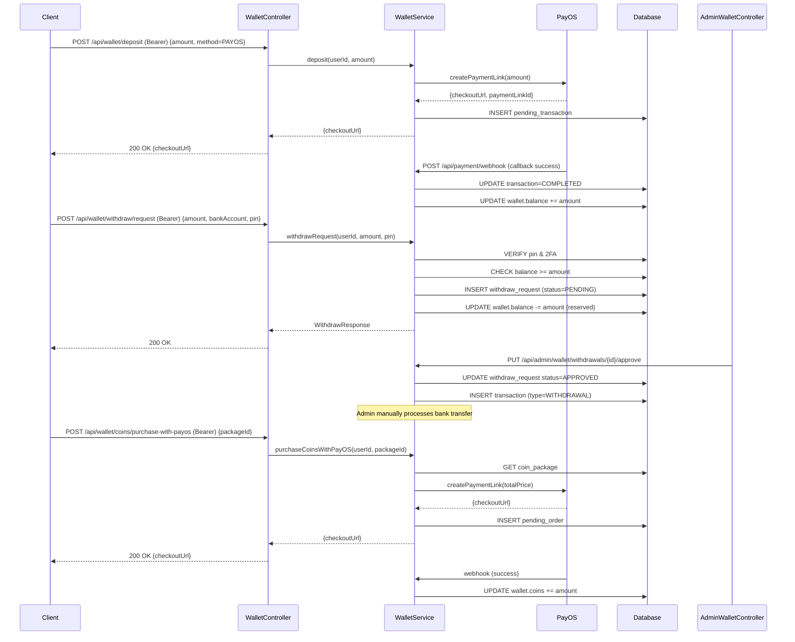
```mermaid
sequenceDiagram
    participant C as Client
    participant WC as WalletController
    participant WS as WalletService
    participant PayOS as PayOS
    participant DB as Database
    participant AWC as AdminWalletController

    %% Deposit (nạp tiền)
    C->>WC: POST /api/wallet/deposit (Bearer) {amount, method=PAYOS}
    WC->>WS: deposit(userId, amount)
    WS->>PayOS: createPaymentLink(amount)
    PayOS-->>WS: {checkoutUrl, paymentLinkId}
    WS->>DB: INSERT pending_transaction
    WS-->>WC: {checkoutUrl}
    WC-->>C: 200 OK {checkoutUrl}
    PayOS->>WS: POST /api/payment/webhook (callback success)
    WS->>DB: UPDATE transaction=COMPLETED
    WS->>DB: UPDATE wallet.balance += amount

    %% Rút tiền
    C->>WC: POST /api/wallet/withdraw/request (Bearer) {amount, bankAccount, pin}
    WC->>WS: withdrawRequest(userId, amount, pin)
    WS->>DB: VERIFY pin & 2FA
    WS->>DB: CHECK balance >= amount
    WS->>DB: INSERT withdraw_request (status=PENDING)
    WS->>DB: UPDATE wallet.balance -= amount (reserved)
    WS-->>WC: WithdrawResponse
    WC-->>C: 200 OK

    %% Admin phê duyệt rút tiền
    AWC->>WS: PUT /api/admin/wallet/withdrawals/{id}/approve
    WS->>DB: UPDATE withdraw_request status=APPROVED
    WS->>DB: INSERT transaction (type=WITHDRAWAL)
    Note over WS: Admin manually processes bank transfer

    %% Mua coin bằng PayOS
    C->>WC: POST /api/wallet/coins/purchase-with-payos (Bearer) {packageId}
    WC->>WS: purchaseCoinsWithPayOS(userId, packageId)
    WS->>DB: GET coin_package
    WS->>PayOS: createPaymentLink(totalPrice)
    PayOS-->>WS: {checkoutUrl}
    WS->>DB: INSERT pending_order
    WS-->>WC: {checkoutUrl}
    WC-->>C: 200 OK {checkoutUrl}
    PayOS->>WS: webhook (success)
    WS->>DB: UPDATE wallet.coins += amount
```

---

## 6. Mentor – Đăng ký & Profile

**Endpoints:** `POST /api/mentor/register`, `GET /api/mentor/profile/{id}`, `PUT /api/mentor/profile`, `GET /api/mentor/favorite`, `POST /api/mentor/favorite/{mentorId}`

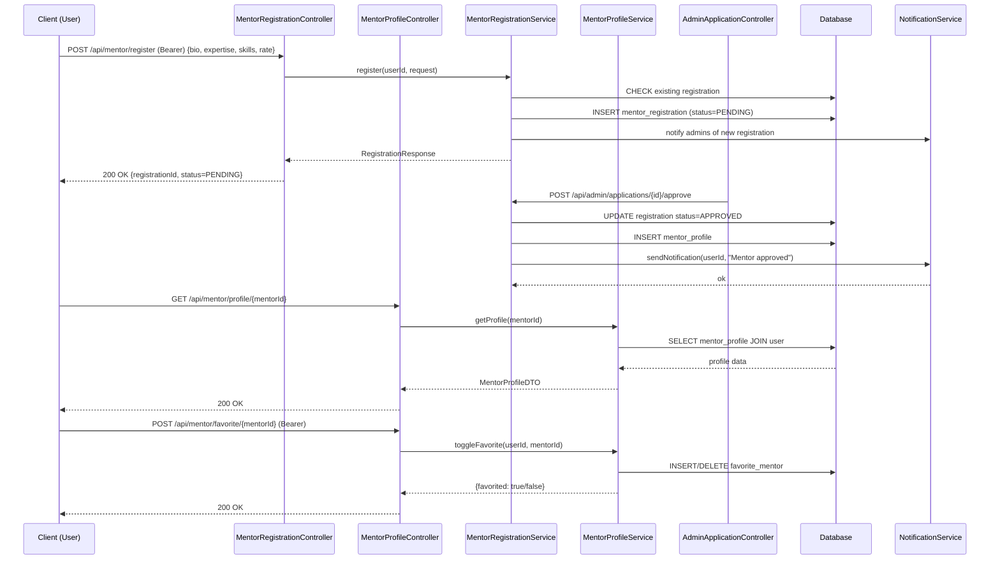
```mermaid
sequenceDiagram
    participant C as Client (User)
    participant MRC as MentorRegistrationController
    participant MPC as MentorProfileController
    participant MRS as MentorRegistrationService
    participant MPS as MentorProfileService
    participant AdminC as AdminApplicationController
    participant DB as Database
    participant NS as NotificationService

    %% Đăng ký làm mentor
    C->>MRC: POST /api/mentor/register (Bearer) {bio, expertise, skills, rate}
    MRC->>MRS: register(userId, request)
    MRS->>DB: CHECK existing registration
    MRS->>DB: INSERT mentor_registration (status=PENDING)
    MRS->>NS: notify admins of new registration
    MRS-->>MRC: RegistrationResponse
    MRC-->>C: 200 OK {registrationId, status=PENDING}

    %% Admin duyệt đăng ký
    AdminC->>MRS: POST /api/admin/applications/{id}/approve
    MRS->>DB: UPDATE registration status=APPROVED
    MRS->>DB: INSERT mentor_profile
    MRS->>NS: sendNotification(userId, "Mentor approved")
    NS-->>MRS: ok

    %% Xem profile mentor
    C->>MPC: GET /api/mentor/profile/{mentorId}
    MPC->>MPS: getProfile(mentorId)
    MPS->>DB: SELECT mentor_profile JOIN user
    DB-->>MPS: profile data
    MPS-->>MPC: MentorProfileDTO
    MPC-->>C: 200 OK

    %% Yêu thích mentor
    C->>MPC: POST /api/mentor/favorite/{mentorId} (Bearer)
    MPC->>MPS: toggleFavorite(userId, mentorId)
    MPS->>DB: INSERT/DELETE favorite_mentor
    MPS-->>MPC: {favorited: true/false}
    MPC-->>C: 200 OK
```

---

## 7. Mentor Booking

**Endpoints:** `POST /api/mentor-bookings/intent`, `POST /api/mentor-bookings/wallet`, `PUT /api/mentor-bookings/{id}/approve`, `PUT /api/mentor-bookings/{id}/start`, `PUT /api/mentor-bookings/{id}/complete`, `POST /api/mentor-bookings/{id}/rating`, `POST /api/mentor-availability`, `POST /api/reviews/booking/{bookingId}`

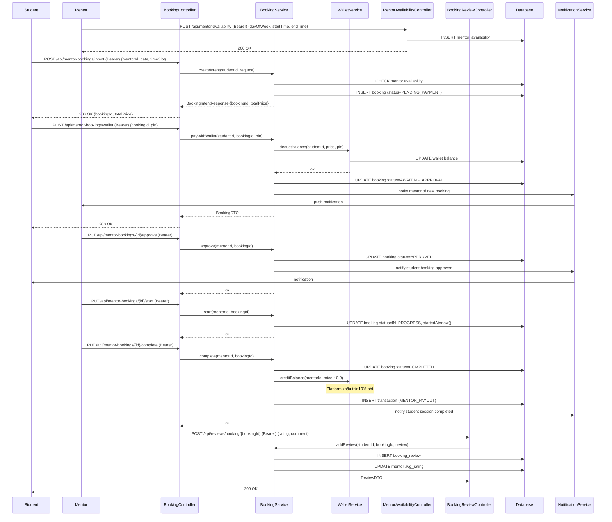
```mermaid
sequenceDiagram
    participant S as Student
    participant M as Mentor
    participant BC as BookingController
    participant BS as BookingService
    participant WS as WalletService
    participant MAC as MentorAvailabilityController
    participant RVC as BookingReviewController
    participant DB as Database
    participant NS as NotificationService

    %% Mentor tạo lịch available
    M->>MAC: POST /api/mentor-availability (Bearer) {dayOfWeek, startTime, endTime}
    MAC->>DB: INSERT mentor_availability
    MAC-->>M: 200 OK

    %% Học viên tạo booking intent
    S->>BC: POST /api/mentor-bookings/intent (Bearer) {mentorId, date, timeSlot}
    BC->>BS: createIntent(studentId, request)
    BS->>DB: CHECK mentor availability
    BS->>DB: INSERT booking (status=PENDING_PAYMENT)
    BS-->>BC: BookingIntentResponse {bookingId, totalPrice}
    BC-->>S: 200 OK {bookingId, totalPrice}

    %% Thanh toán bằng wallet
    S->>BC: POST /api/mentor-bookings/wallet (Bearer) {bookingId, pin}
    BC->>BS: payWithWallet(studentId, bookingId, pin)
    BS->>WS: deductBalance(studentId, price, pin)
    WS->>DB: UPDATE wallet balance
    WS-->>BS: ok
    BS->>DB: UPDATE booking status=AWAITING_APPROVAL
    BS->>NS: notify mentor of new booking
    NS->>M: push notification
    BS-->>BC: BookingDTO
    BC-->>S: 200 OK

    %% Mentor phê duyệt
    M->>BC: PUT /api/mentor-bookings/{id}/approve (Bearer)
    BC->>BS: approve(mentorId, bookingId)
    BS->>DB: UPDATE booking status=APPROVED
    BS->>NS: notify student booking approved
    NS->>S: notification
    BS-->>BC: ok

    %% Bắt đầu session
    M->>BC: PUT /api/mentor-bookings/{id}/start (Bearer)
    BC->>BS: start(mentorId, bookingId)
    BS->>DB: UPDATE booking status=IN_PROGRESS, startedAt=now()
    BS-->>BC: ok

    %% Hoàn thành session
    M->>BC: PUT /api/mentor-bookings/{id}/complete (Bearer)
    BC->>BS: complete(mentorId, bookingId)
    BS->>DB: UPDATE booking status=COMPLETED
    BS->>WS: creditBalance(mentorId, price * 0.9)
    Note over WS: Platform khấu trừ 10% phí
    BS->>DB: INSERT transaction (MENTOR_PAYOUT)
    BS->>NS: notify student session completed
    BS-->>BC: ok

    %% Học viên đánh giá
    S->>RVC: POST /api/reviews/booking/{bookingId} (Bearer) {rating, comment}
    RVC->>BS: addReview(studentId, bookingId, review)
    BS->>DB: INSERT booking_review
    BS->>DB: UPDATE mentor avg_rating
    BS-->>RVC: ReviewDTO
    RVC-->>S: 200 OK
```

---

## 8. AI Chatbot

**Endpoints:** `POST /api/v1/ai/chat`, `GET /api/v1/ai/chat/sessions`, `GET /api/v1/ai/chat/history/{sessionId}`, `DELETE /api/v1/ai/chat/sessions/{sessionId}`, `POST /api/v1/ai/speech/stt`, `POST /api/v1/ai/speech/tts`

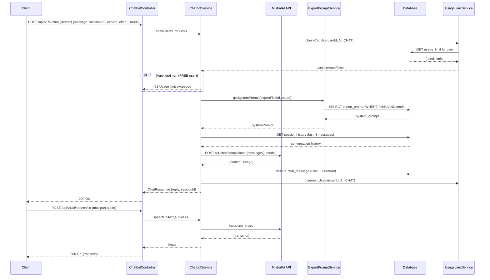
```mermaid
sequenceDiagram
    participant C as Client
    participant CC as ChatbotController
    participant CS as ChatbotService
    participant MistralAI as MistralAI API
    participant EP as ExpertPromptService
    participant DB as Database
    participant UL as UsageLimitService

    %% Gửi tin nhắn
    C->>CC: POST /api/v1/ai/chat (Bearer) {message, sessionId?, expertFieldId?, mode}
    CC->>CS: chat(userId, request)
    CS->>UL: checkCanUse(userId, AI_CHAT)
    UL->>DB: GET usage_limit for user
    DB-->>UL: {used, limit}
    UL-->>CS: canUse=true/false
    alt Vượt giới hạn (FREE user)
        CS-->>CC: 429 Usage limit exceeded
    end
    CS->>EP: getSystemPrompt(expertFieldId, mode)
    EP->>DB: SELECT expert_prompt WHERE fieldId AND mode
    DB-->>EP: system_prompt
    EP-->>CS: systemPrompt
    CS->>DB: GET session history (last N messages)
    DB-->>CS: conversation history
    CS->>MistralAI: POST /v1/chat/completions {messages[], model}
    MistralAI-->>CS: {content, usage}
    CS->>DB: INSERT chat_message (user + assistant)
    CS->>UL: incrementUsage(userId, AI_CHAT)
    CS-->>CC: ChatResponse {reply, sessionId}
    CC-->>C: 200 OK

    %% Speech to Text
    C->>CC: POST /api/v1/ai/speech/stt (multipart audio)
    CC->>CS: speechToText(audioFile)
    CS->>MistralAI: transcribe audio
    MistralAI-->>CS: {transcript}
    CS-->>CC: {text}
    CC-->>C: 200 OK {transcript}
```

---

## 9. AI Roadmap

**Endpoints:** `POST /api/v1/ai/roadmap/generate`, `POST /api/v1/ai/roadmap/validate`, `POST /api/v1/ai/roadmap/clarify`, `GET /api/v1/ai/roadmap`, `GET /api/v1/ai/roadmap/{sessionId}`, `POST /api/v1/ai/roadmap/{sessionId}/progress`

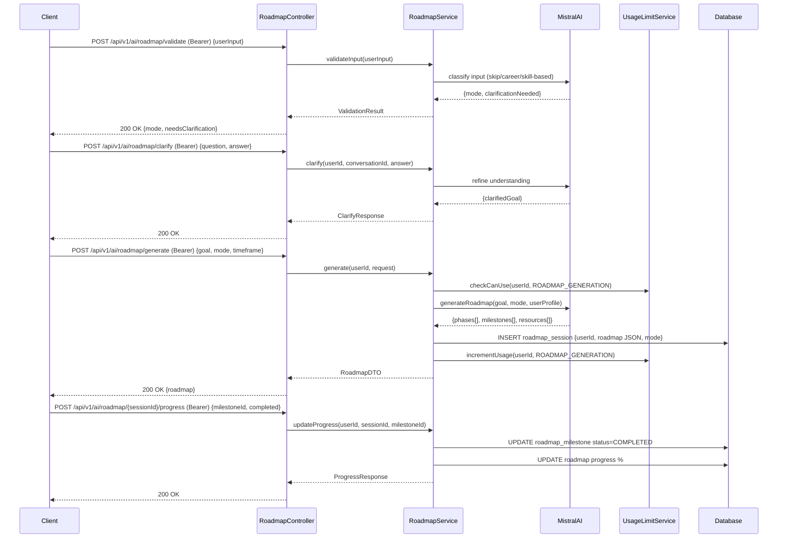
```mermaid
sequenceDiagram
    participant C as Client
    participant RC as RoadmapController
    participant RS as RoadmapService
    participant AI as MistralAI
    participant UL as UsageLimitService
    participant DB as Database

    %% Validate input trước khi generate
    C->>RC: POST /api/v1/ai/roadmap/validate (Bearer) {userInput}
    RC->>RS: validateInput(userInput)
    RS->>AI: classify input (skip/career/skill-based)
    AI-->>RS: {mode, clarificationNeeded}
    RS-->>RC: ValidationResult
    RC-->>C: 200 OK {mode, needsClarification}

    %% Nếu cần làm rõ
    C->>RC: POST /api/v1/ai/roadmap/clarify (Bearer) {question, answer}
    RC->>RS: clarify(userId, conversationId, answer)
    RS->>AI: refine understanding
    AI-->>RS: {clarifiedGoal}
    RS-->>RC: ClarifyResponse
    RC-->>C: 200 OK

    %% Generate roadmap
    C->>RC: POST /api/v1/ai/roadmap/generate (Bearer) {goal, mode, timeframe}
    RC->>RS: generate(userId, request)
    RS->>UL: checkCanUse(userId, ROADMAP_GENERATION)
    RS->>AI: generateRoadmap(goal, mode, userProfile)
    AI-->>RS: {phases[], milestones[], resources[]}
    RS->>DB: INSERT roadmap_session {userId, roadmap JSON, mode}
    RS->>UL: incrementUsage(userId, ROADMAP_GENERATION)
    RS-->>RC: RoadmapDTO
    RC-->>C: 200 OK {roadmap}

    %% Cập nhật tiến độ roadmap
    C->>RC: POST /api/v1/ai/roadmap/{sessionId}/progress (Bearer) {milestoneId, completed}
    RC->>RS: updateProgress(userId, sessionId, milestoneId)
    RS->>DB: UPDATE roadmap_milestone status=COMPLETED
    RS->>DB: UPDATE roadmap progress %
    RS-->>RC: ProgressResponse
    RC-->>C: 200 OK
```

---

## 10. Study Planner

**Endpoints:** `POST /api/study-planner/generate-proposal`, `POST /api/study-planner/generate-schedule`, `POST /api/study-planner/sessions`, `GET /api/study-planner/sessions`, `PATCH /api/study-planner/sessions/{id}/status`, `POST /api/study-planner/schedule-health`, `POST /api/study-planner/schedule-suggest-fix`

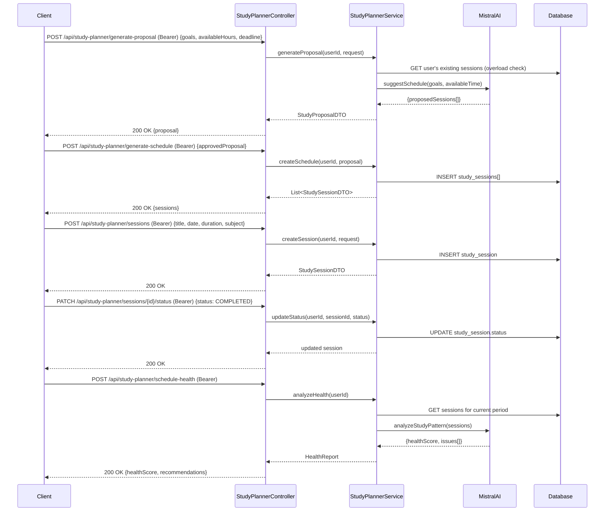
```mermaid
sequenceDiagram
    participant C as Client
    participant SPC as StudyPlannerController
    participant SPS as StudyPlannerService
    participant AI as MistralAI
    participant DB as Database

    %% AI tạo đề xuất lịch học
    C->>SPC: POST /api/study-planner/generate-proposal (Bearer) {goals, availableHours, deadline}
    SPC->>SPS: generateProposal(userId, request)
    SPS->>DB: GET user's existing sessions (overload check)
    SPS->>AI: suggestSchedule(goals, availableTime)
    AI-->>SPS: {proposedSessions[]}
    SPS-->>SPC: StudyProposalDTO
    SPC-->>C: 200 OK {proposal}

    %% Confirm & tạo lịch học
    C->>SPC: POST /api/study-planner/generate-schedule (Bearer) {approvedProposal}
    SPC->>SPS: createSchedule(userId, proposal)
    SPS->>DB: INSERT study_sessions[]
    SPS-->>SPC: List<StudySessionDTO>
    SPC-->>C: 200 OK {sessions}

    %% Tạo 1 session thủ công
    C->>SPC: POST /api/study-planner/sessions (Bearer) {title, date, duration, subject}
    SPC->>SPS: createSession(userId, request)
    SPS->>DB: INSERT study_session
    SPS-->>SPC: StudySessionDTO
    SPC-->>C: 200 OK

    %% Cập nhật trạng thái session
    C->>SPC: PATCH /api/study-planner/sessions/{id}/status (Bearer) {status: COMPLETED}
    SPC->>SPS: updateStatus(userId, sessionId, status)
    SPS->>DB: UPDATE study_session.status
    SPS-->>SPC: updated session
    SPC-->>C: 200 OK

    %% Kiểm tra sức khoẻ lịch học
    C->>SPC: POST /api/study-planner/schedule-health (Bearer)
    SPC->>SPS: analyzeHealth(userId)
    SPS->>DB: GET sessions for current period
    SPS->>AI: analyzeStudyPattern(sessions)
    AI-->>SPS: {healthScore, issues[]}
    SPS-->>SPC: HealthReport
    SPC-->>C: 200 OK {healthScore, recommendations}
```

---

## 11. Task Board

**Endpoints:** `GET /api/task-board`, `POST /api/task-board/columns`, `POST /api/task-board/tasks`, `PATCH /api/task-board/tasks/{id}`, `PATCH /api/task-board/tasks/{id}/move`, `DELETE /api/task-board/tasks/{id}`, `GET/POST/PATCH/DELETE /api/task-board/notes`

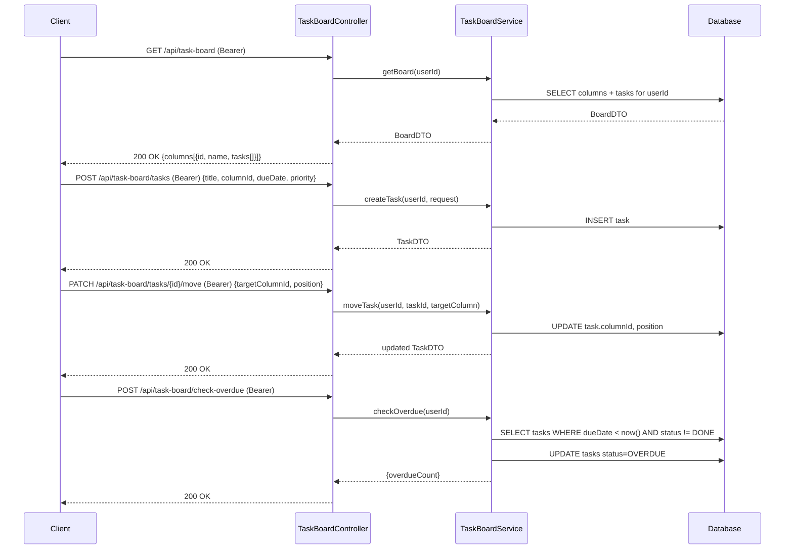
```mermaid
sequenceDiagram
    participant C as Client
    participant TBC as TaskBoardController
    participant TBS as TaskBoardService
    participant DB as Database

    %% Lấy board
    C->>TBC: GET /api/task-board (Bearer)
    TBC->>TBS: getBoard(userId)
    TBS->>DB: SELECT columns + tasks for userId
    DB-->>TBS: BoardDTO
    TBS-->>TBC: BoardDTO
    TBC-->>C: 200 OK {columns[{id, name, tasks[]}]}

    %% Tạo task
    C->>TBC: POST /api/task-board/tasks (Bearer) {title, columnId, dueDate, priority}
    TBC->>TBS: createTask(userId, request)
    TBS->>DB: INSERT task
    TBS-->>TBC: TaskDTO
    TBC-->>C: 200 OK

    %% Di chuyển task giữa các cột
    C->>TBC: PATCH /api/task-board/tasks/{id}/move (Bearer) {targetColumnId, position}
    TBC->>TBS: moveTask(userId, taskId, targetColumn)
    TBS->>DB: UPDATE task.columnId, position
    TBS-->>TBC: updated TaskDTO
    TBC-->>C: 200 OK

    %% Kiểm tra task quá hạn
    C->>TBC: POST /api/task-board/check-overdue (Bearer)
    TBC->>TBS: checkOverdue(userId)
    TBS->>DB: SELECT tasks WHERE dueDate < now() AND status != DONE
    TBS->>DB: UPDATE tasks status=OVERDUE
    TBS-->>TBC: {overdueCount}
    TBC-->>C: 200 OK
```

---

## 12. Course

**Endpoints:** `POST /api/courses`, `PUT /api/courses/{id}`, `POST /api/courses/{id}/submit`, `POST /api/courses/{id}/approve`, `POST /api/courses/{id}/reject`, `GET /api/courses`, `POST /api/courses/{id}/modules`, `POST /api/lessons`, `POST /api/quizzes`, `POST /api/assignments`

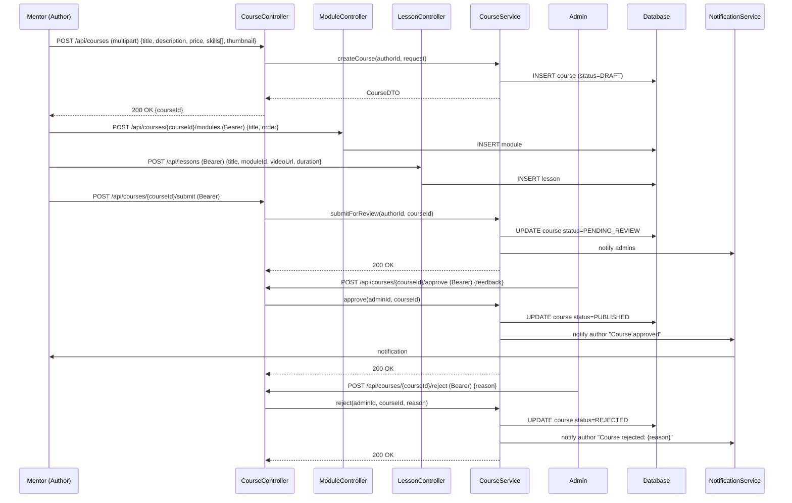
```mermaid
sequenceDiagram
    participant M as Mentor (Author)
    participant CC as CourseController
    participant MC as ModuleController
    participant LC as LessonController
    participant CS as CourseService
    participant Admin as Admin
    participant DB as Database
    participant NS as NotificationService

    %% Tạo khoá học
    M->>CC: POST /api/courses (multipart) {title, description, price, skills[], thumbnail}
    CC->>CS: createCourse(authorId, request)
    CS->>DB: INSERT course (status=DRAFT)
    CS-->>CC: CourseDTO
    CC-->>M: 200 OK {courseId}

    %% Thêm module và lesson
    M->>MC: POST /api/courses/{courseId}/modules (Bearer) {title, order}
    MC->>DB: INSERT module
    M->>LC: POST /api/lessons (Bearer) {title, moduleId, videoUrl, duration}
    LC->>DB: INSERT lesson

    %% Submit để review
    M->>CC: POST /api/courses/{courseId}/submit (Bearer)
    CC->>CS: submitForReview(authorId, courseId)
    CS->>DB: UPDATE course status=PENDING_REVIEW
    CS->>NS: notify admins
    CS-->>CC: 200 OK

    %% Admin duyệt
    Admin->>CC: POST /api/courses/{courseId}/approve (Bearer) {feedback}
    CC->>CS: approve(adminId, courseId)
    CS->>DB: UPDATE course status=PUBLISHED
    CS->>NS: notify author "Course approved"
    NS->>M: notification
    CS-->>CC: 200 OK

    %% Admin từ chối
    Admin->>CC: POST /api/courses/{courseId}/reject (Bearer) {reason}
    CC->>CS: reject(adminId, courseId, reason)
    CS->>DB: UPDATE course status=REJECTED
    CS->>NS: notify author "Course rejected: {reason}"
    CS-->>CC: 200 OK
```

---

## 13. Khóa học – Mua & Enroll

**Endpoints:** `POST /api/course-purchases/intent`, `POST /api/course-purchases/wallet`, `POST /api/enrollments`, `GET /api/enrollments/user/{userId}`, `PUT /api/enrollments/course/{id}/user/{id}/progress`

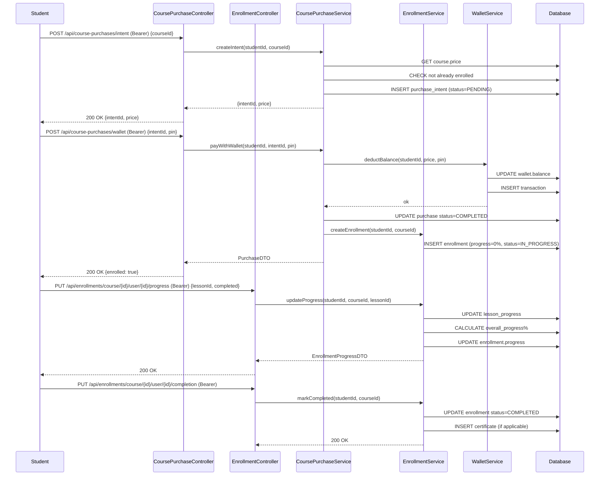
```mermaid
sequenceDiagram
    participant S as Student
    participant CPC as CoursePurchaseController
    participant EC as EnrollmentController
    participant CPS as CoursePurchaseService
    participant ES as EnrollmentService
    participant WS as WalletService
    participant DB as Database

    %% Tạo intent mua khoá học
    S->>CPC: POST /api/course-purchases/intent (Bearer) {courseId}
    CPC->>CPS: createIntent(studentId, courseId)
    CPS->>DB: GET course.price
    CPS->>DB: CHECK not already enrolled
    CPS->>DB: INSERT purchase_intent (status=PENDING)
    CPS-->>CPC: {intentId, price}
    CPC-->>S: 200 OK {intentId, price}

    %% Thanh toán bằng wallet
    S->>CPC: POST /api/course-purchases/wallet (Bearer) {intentId, pin}
    CPC->>CPS: payWithWallet(studentId, intentId, pin)
    CPS->>WS: deductBalance(studentId, price, pin)
    WS->>DB: UPDATE wallet.balance
    WS->>DB: INSERT transaction
    WS-->>CPS: ok
    CPS->>DB: UPDATE purchase status=COMPLETED
    CPS->>ES: createEnrollment(studentId, courseId)
    ES->>DB: INSERT enrollment (progress=0%, status=IN_PROGRESS)
    CPS-->>CPC: PurchaseDTO
    CPC-->>S: 200 OK {enrolled: true}

    %% Cập nhật tiến độ
    S->>EC: PUT /api/enrollments/course/{id}/user/{id}/progress (Bearer) {lessonId, completed}
    EC->>ES: updateProgress(studentId, courseId, lessonId)
    ES->>DB: UPDATE lesson_progress
    ES->>DB: CALCULATE overall_progress%
    ES->>DB: UPDATE enrollment.progress
    ES-->>EC: EnrollmentProgressDTO
    EC-->>S: 200 OK

    %% Hoàn thành khoá học
    S->>EC: PUT /api/enrollments/course/{id}/user/{id}/completion (Bearer)
    EC->>ES: markCompleted(studentId, courseId)
    ES->>DB: UPDATE enrollment status=COMPLETED
    ES->>DB: INSERT certificate (if applicable)
    ES-->>EC: 200 OK
```

---

## 14. Quiz & Codelab

**Endpoints:** `POST /api/quizzes`, `POST /api/quizzes/{id}/submit`, `POST /api/codelabs`, `POST /api/codelabs/{id}/submissions`

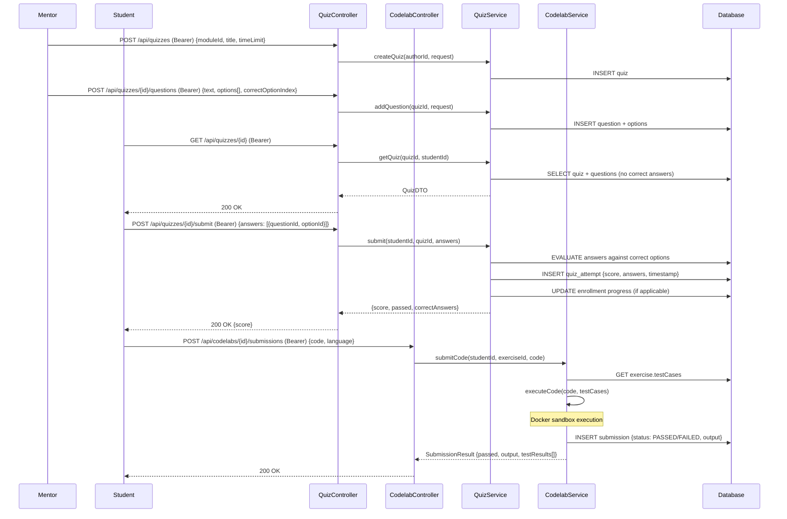
```mermaid
sequenceDiagram
    participant M as Mentor
    participant S as Student
    participant QC as QuizController
    participant CLC as CodelabController
    participant QS as QuizService
    participant CLS as CodelabService
    participant DB as Database

    %% Tạo quiz
    M->>QC: POST /api/quizzes (Bearer) {moduleId, title, timeLimit}
    QC->>QS: createQuiz(authorId, request)
    QS->>DB: INSERT quiz
    M->>QC: POST /api/quizzes/{id}/questions (Bearer) {text, options[], correctOptionIndex}
    QC->>QS: addQuestion(quizId, request)
    QS->>DB: INSERT question + options

    %% Làm quiz
    S->>QC: GET /api/quizzes/{id} (Bearer)
    QC->>QS: getQuiz(quizId, studentId)
    QS->>DB: SELECT quiz + questions (no correct answers)
    QS-->>QC: QuizDTO
    QC-->>S: 200 OK

    S->>QC: POST /api/quizzes/{id}/submit (Bearer) {answers: [{questionId, optionId}]}
    QC->>QS: submit(studentId, quizId, answers)
    QS->>DB: EVALUATE answers against correct options
    QS->>DB: INSERT quiz_attempt {score, answers, timestamp}
    QS->>DB: UPDATE enrollment progress (if applicable)
    QS-->>QC: {score, passed, correctAnswers}
    QC-->>S: 200 OK {score}

    %% Codelab submission
    S->>CLC: POST /api/codelabs/{id}/submissions (Bearer) {code, language}
    CLC->>CLS: submitCode(studentId, exerciseId, code)
    CLS->>DB: GET exercise.testCases
    CLS->>CLS: executeCode(code, testCases)
    Note over CLS: Docker sandbox execution
    CLS->>DB: INSERT submission {status: PASSED/FAILED, output}
    CLS-->>CLC: SubmissionResult {passed, output, testResults[]}
    CLC-->>S: 200 OK
```

---

## 15. Gamification

**Endpoints:** `GET /api/gamification/dashboard`, `POST /api/gamification/games/start`, `POST /api/gamification/games/complete`, `GET /api/gamification/badges`, `GET /api/gamification/leaderboard`, `GET /api/gamification/leaderboard/position`

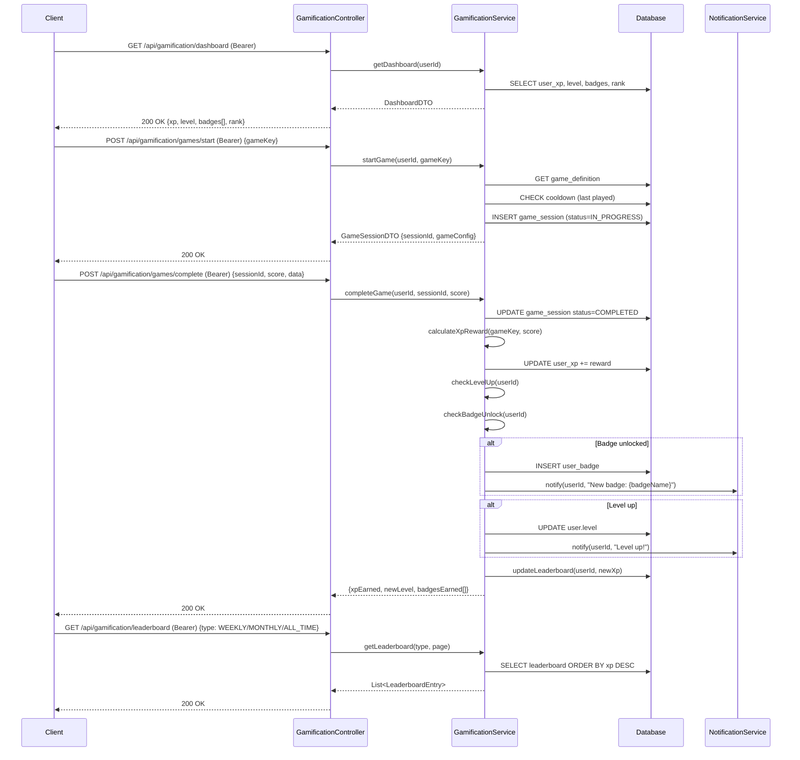
```mermaid
sequenceDiagram
    participant C as Client
    participant GC as GamificationController
    participant GS as GamificationService
    participant DB as Database
    participant NS as NotificationService

    %% Dashboard điểm XP
    C->>GC: GET /api/gamification/dashboard (Bearer)
    GC->>GS: getDashboard(userId)
    GS->>DB: SELECT user_xp, level, badges, rank
    GS-->>GC: DashboardDTO
    GC-->>C: 200 OK {xp, level, badges[], rank}

    %% Bắt đầu mini-game
    C->>GC: POST /api/gamification/games/start (Bearer) {gameKey}
    GC->>GS: startGame(userId, gameKey)
    GS->>DB: GET game_definition
    GS->>DB: CHECK cooldown (last played)
    GS->>DB: INSERT game_session (status=IN_PROGRESS)
    GS-->>GC: GameSessionDTO {sessionId, gameConfig}
    GC-->>C: 200 OK

    %% Hoàn thành game
    C->>GC: POST /api/gamification/games/complete (Bearer) {sessionId, score, data}
    GC->>GS: completeGame(userId, sessionId, score)
    GS->>DB: UPDATE game_session status=COMPLETED
    GS->>GS: calculateXpReward(gameKey, score)
    GS->>DB: UPDATE user_xp += reward
    GS->>GS: checkLevelUp(userId)
    GS->>GS: checkBadgeUnlock(userId)
    alt Badge unlocked
        GS->>DB: INSERT user_badge
        GS->>NS: notify(userId, "New badge: {badgeName}")
    end
    alt Level up
        GS->>DB: UPDATE user.level
        GS->>NS: notify(userId, "Level up!")
    end
    GS->>DB: updateLeaderboard(userId, newXp)
    GS-->>GC: {xpEarned, newLevel, badgesEarned[]}
    GC-->>C: 200 OK

    %% Leaderboard
    C->>GC: GET /api/gamification/leaderboard (Bearer) {type: WEEKLY/MONTHLY/ALL_TIME}
    GC->>GS: getLeaderboard(type, page)
    GS->>DB: SELECT leaderboard ORDER BY xp DESC
    GS-->>GC: List<LeaderboardEntry>
    GC-->>C: 200 OK
```

---

## 16. Daily Check-in / Streak

**Endpoints:** `POST /api/streak/check-in`, `GET /api/streak/info`, `GET /api/streak/status`

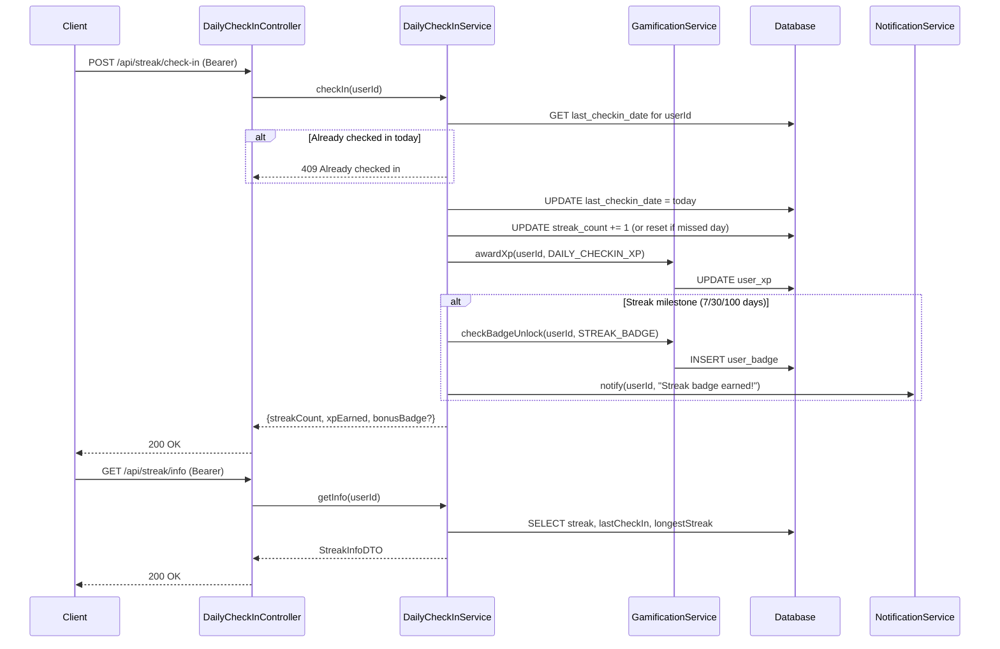
```mermaid
sequenceDiagram
    participant C as Client
    participant DCC as DailyCheckInController
    participant DCS as DailyCheckInService
    participant GS as GamificationService
    participant DB as Database
    participant NS as NotificationService

    C->>DCC: POST /api/streak/check-in (Bearer)
    DCC->>DCS: checkIn(userId)
    DCS->>DB: GET last_checkin_date for userId
    alt Already checked in today
        DCS-->>DCC: 409 Already checked in
    end
    DCS->>DB: UPDATE last_checkin_date = today
    DCS->>DB: UPDATE streak_count += 1 (or reset if missed day)
    DCS->>GS: awardXp(userId, DAILY_CHECKIN_XP)
    GS->>DB: UPDATE user_xp
    alt Streak milestone (7/30/100 days)
        DCS->>GS: checkBadgeUnlock(userId, STREAK_BADGE)
        GS->>DB: INSERT user_badge
        DCS->>NS: notify(userId, "Streak badge earned!")
    end
    DCS-->>DCC: {streakCount, xpEarned, bonusBadge?}
    DCC-->>C: 200 OK

    C->>DCC: GET /api/streak/info (Bearer)
    DCC->>DCS: getInfo(userId)
    DCS->>DB: SELECT streak, lastCheckIn, longestStreak
    DCS-->>DCC: StreakInfoDTO
    DCC-->>C: 200 OK
```

---

## 17. Community Posts

**Endpoints:** `POST /api/posts`, `GET /api/posts`, `PUT /api/posts/{id}`, `POST /api/posts/{id}/like`, `POST /api/posts/{id}/comments`, `POST /api/posts/{id}/save`, `POST /api/posts/{id}/comments/{cId}/report`

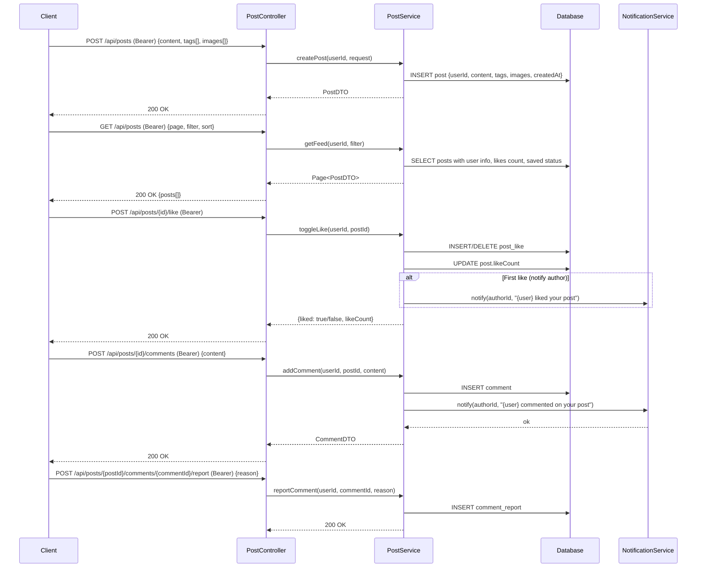
```mermaid
sequenceDiagram
    participant C as Client
    participant PC as PostController
    participant PS as PostService
    participant DB as Database
    participant NS as NotificationService

    %% Tạo bài đăng
    C->>PC: POST /api/posts (Bearer) {content, tags[], images[]}
    PC->>PS: createPost(userId, request)
    PS->>DB: INSERT post {userId, content, tags, images, createdAt}
    PS-->>PC: PostDTO
    PC-->>C: 200 OK

    %% Feed bài đăng
    C->>PC: GET /api/posts (Bearer) {page, filter, sort}
    PC->>PS: getFeed(userId, filter)
    PS->>DB: SELECT posts with user info, likes count, saved status
    PS-->>PC: Page<PostDTO>
    PC-->>C: 200 OK {posts[]}

    %% Like bài đăng
    C->>PC: POST /api/posts/{id}/like (Bearer)
    PC->>PS: toggleLike(userId, postId)
    PS->>DB: INSERT/DELETE post_like
    PS->>DB: UPDATE post.likeCount
    alt First like (notify author)
        PS->>NS: notify(authorId, "{user} liked your post")
    end
    PS-->>PC: {liked: true/false, likeCount}
    PC-->>C: 200 OK

    %% Bình luận
    C->>PC: POST /api/posts/{id}/comments (Bearer) {content}
    PC->>PS: addComment(userId, postId, content)
    PS->>DB: INSERT comment
    PS->>NS: notify(authorId, "{user} commented on your post")
    NS-->>PS: ok
    PS-->>PC: CommentDTO
    PC-->>C: 200 OK

    %% Báo cáo bình luận
    C->>PC: POST /api/posts/{postId}/comments/{commentId}/report (Bearer) {reason}
    PC->>PS: reportComment(userId, commentId, reason)
    PS->>DB: INSERT comment_report
    PS-->>PC: 200 OK
```

---

## 18. PreChat (Nhắn tin P2P)

**Endpoints:** `POST /api/prechat/send`, `GET /api/prechat/threads`, `GET /api/prechat/conversation`, `PUT /api/prechat/threads/{id}/mute`, `DELETE /api/prechat/threads/{id}`, `PUT /api/prechat/block/{userId}`

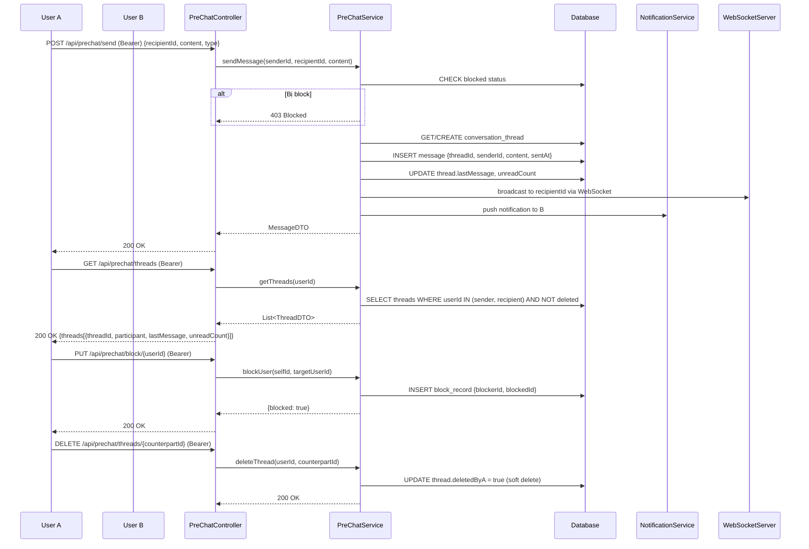
```mermaid
sequenceDiagram
    participant A as User A
    participant B as User B
    participant PCC as PreChatController
    participant PCS as PreChatService
    participant DB as Database
    participant NS as NotificationService
    participant WS as WebSocketServer

    %% Gửi tin nhắn
    A->>PCC: POST /api/prechat/send (Bearer) {recipientId, content, type}
    PCC->>PCS: sendMessage(senderId, recipientId, content)
    PCS->>DB: CHECK blocked status
    alt Bị block
        PCS-->>PCC: 403 Blocked
    end
    PCS->>DB: GET/CREATE conversation_thread
    PCS->>DB: INSERT message {threadId, senderId, content, sentAt}
    PCS->>DB: UPDATE thread.lastMessage, unreadCount
    PCS->>WS: broadcast to recipientId via WebSocket
    PCS->>NS: push notification to B
    PCS-->>PCC: MessageDTO
    PCC-->>A: 200 OK

    %% Xem danh sách threads
    A->>PCC: GET /api/prechat/threads (Bearer)
    PCC->>PCS: getThreads(userId)
    PCS->>DB: SELECT threads WHERE userId IN (sender, recipient) AND NOT deleted
    PCS-->>PCC: List<ThreadDTO>
    PCC-->>A: 200 OK {threads[{threadId, participant, lastMessage, unreadCount}]}

    %% Block người dùng
    A->>PCC: PUT /api/prechat/block/{userId} (Bearer)
    PCC->>PCS: blockUser(selfId, targetUserId)
    PCS->>DB: INSERT block_record {blockerId, blockedId}
    PCS-->>PCC: {blocked: true}
    PCC-->>A: 200 OK

    %% Xoá thread
    A->>PCC: DELETE /api/prechat/threads/{counterpartId} (Bearer)
    PCC->>PCS: deleteThread(userId, counterpartId)
    PCS->>DB: UPDATE thread.deletedByA = true (soft delete)
    PCS-->>PCC: 200 OK
```

---

## 19. Group Chat

**Endpoints:** `POST /api/group-chats`, `POST /api/group-chats/{id}/join`, `POST /api/group-chats/{id}/leave`, `POST /api/group-chats/{id}/kick`, `GET /api/group-chats/{id}/messages`

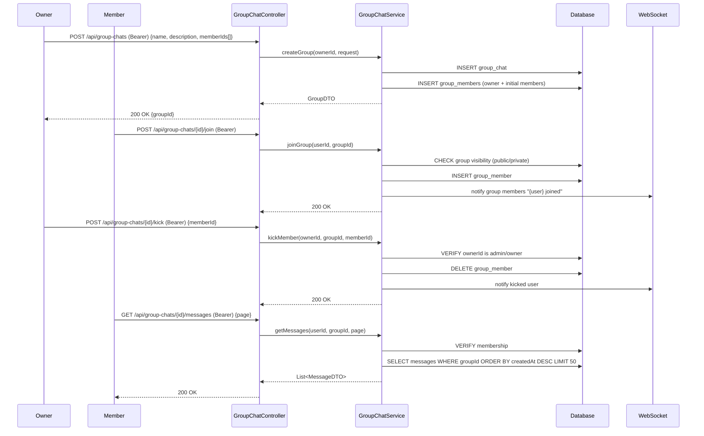
```mermaid
sequenceDiagram
    participant O as Owner
    participant M as Member
    participant GCC as GroupChatController
    participant GCS as GroupChatService
    participant DB as Database
    participant WS as WebSocket

    O->>GCC: POST /api/group-chats (Bearer) {name, description, memberIds[]}
    GCC->>GCS: createGroup(ownerId, request)
    GCS->>DB: INSERT group_chat
    GCS->>DB: INSERT group_members (owner + initial members)
    GCS-->>GCC: GroupDTO
    GCC-->>O: 200 OK {groupId}

    M->>GCC: POST /api/group-chats/{id}/join (Bearer)
    GCC->>GCS: joinGroup(userId, groupId)
    GCS->>DB: CHECK group visibility (public/private)
    GCS->>DB: INSERT group_member
    GCS->>WS: notify group members "{user} joined"
    GCS-->>GCC: 200 OK

    O->>GCC: POST /api/group-chats/{id}/kick (Bearer) {memberId}
    GCC->>GCS: kickMember(ownerId, groupId, memberId)
    GCS->>DB: VERIFY ownerId is admin/owner
    GCS->>DB: DELETE group_member
    GCS->>WS: notify kicked user
    GCS-->>GCC: 200 OK

    M->>GCC: GET /api/group-chats/{id}/messages (Bearer) {page}
    GCC->>GCS: getMessages(userId, groupId, page)
    GCS->>DB: VERIFY membership
    GCS->>DB: SELECT messages WHERE groupId ORDER BY createdAt DESC LIMIT 50
    GCS-->>GCC: List<MessageDTO>
    GCC-->>M: 200 OK
```

---

## 20. Meowl Chat Service

**Endpoints:** `POST /api/v1/meowl/chat`, `GET /api/v1/meowl/sessions`, `GET /api/v1/meowl/history/{sessionId}`  
_(Meowl là chatbot mascot mèo của SkillVerse)_

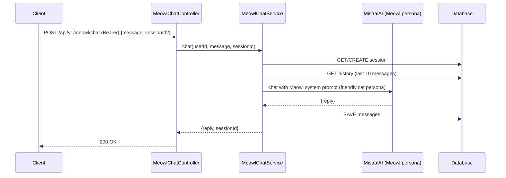
```mermaid
sequenceDiagram
    participant C as Client
    participant MCC as MeowlChatController
    participant MCS as MeowlChatService
    participant AI as MistralAI (Meowl persona)
    participant DB as Database

    C->>MCC: POST /api/v1/meowl/chat (Bearer) {message, sessionId?}
    MCC->>MCS: chat(userId, message, sessionId)
    MCS->>DB: GET/CREATE session
    MCS->>DB: GET history (last 10 messages)
    MCS->>AI: chat with Meowl system prompt (friendly cat persona)
    AI-->>MCS: {reply}
    MCS->>DB: SAVE messages
    MCS-->>MCC: {reply, sessionId}
    MCC-->>C: 200 OK
```

---

## 21. Family Chat & Parent Service

**Endpoints:** `POST /api/family/chat`, `GET /api/family/threads`, `POST /api/parent/link-child`, `GET /api/parent/children/{childId}/progress`

```mermaid
sequenceDiagram
    participant P as Parent
    participant C as Child (Student)
    participant ParC as ParentController
    participant FCC as FamilyChatController
    participant PS as ParentService
    participant FCS as FamilyChatService
    participant DB as Database

    %% Liên kết tài khoản con
    P->>ParC: POST /api/parent/link-child (Bearer) {childEmail, relationshipType}
    ParC->>PS: linkChild(parentId, childEmail)
    PS->>DB: FIND child user by email
    PS->>DB: INSERT parent_child_relationship (status=PENDING)
    PS-->>ParC: LinkRequestResponse
    ParC-->>P: 200 OK {requestSent}

    C->>ParC: POST /api/parent/link-request/{id}/accept (Bearer)
    ParC->>PS: acceptLink(childId, requestId)
    PS->>DB: UPDATE relationship status=ACTIVE
    PS-->>ParC: 200 OK

    %% Xem tiến độ học của con
    P->>ParC: GET /api/parent/children/{childId}/progress (Bearer)
    ParC->>PS: getChildProgress(parentId, childId)
    PS->>DB: VERIFY parent-child link
    PS->>DB: SELECT enrollments + study_sessions + gamification for childId
    PS-->>ParC: ChildProgressDTO
    ParC-->>P: 200 OK {courses[], studyTime, streaks, xp}

    %% Family chat
    P->>FCC: POST /api/family/chat (Bearer) {childId, message}
    FCC->>FCS: sendMessage(parentId, childId, message)
    FCS->>DB: VERIFY family link
    FCS->>DB: INSERT family_message
    FCS-->>FCC: 200 OK
```

---

## 22. Business Hub

**Endpoints:** `POST /api/business/register`, `POST /api/job-postings`, `GET /api/job-postings`, `POST /api/job-applications/{jobId}`, `PUT /api/job-applications/{id}/status`, `POST /api/job-reviews`, `GET /api/recruiter/profile`

```mermaid
sequenceDiagram
    participant R as Recruiter
    participant S as Student
    participant BRC as BusinessRegistrationController
    participant JPC as JobPostingController
    participant JAC as JobApplicationController
    participant BS as BusinessService
    participant DB as Database
    participant NS as NotificationService

    %% Đăng ký tài khoản doanh nghiệp
    R->>BRC: POST /api/business/register (Bearer) {companyName, taxId, website}
    BRC->>BS: register(userId, request)
    BS->>DB: INSERT business_registration (status=PENDING)
    BS-->>BRC: 200 OK {registrationId}

    %% Tạo tin tuyển dụng
    R->>JPC: POST /api/job-postings (Bearer) {title, description, skills[], salary, deadline}
    JPC->>BS: createJob(recruiterId, request)
    BS->>DB: INSERT job_posting (status=ACTIVE)
    BS-->>JPC: JobPostingDTO
    JPC-->>R: 200 OK {jobId}

    %% Học viên ứng tuyển
    S->>JAC: POST /api/job-applications/{jobId} (Bearer) {resumeUrl, coverLetter}
    JAC->>BS: apply(studentId, jobId, request)
    BS->>DB: CHECK not already applied
    BS->>DB: INSERT job_application (status=PENDING)
    BS->>NS: notify recruiter "New application"
    NS->>R: notification
    BS-->>JAC: ApplicationDTO
    JAC-->>S: 200 OK

    %% Recruiter cập nhật trạng thái ứng tuyển
    R->>JAC: PUT /api/job-applications/{id}/status (Bearer) {status: SHORTLISTED/REJECTED/HIRED}
    JAC->>BS: updateStatus(recruiterId, appId, status)
    BS->>DB: UPDATE application.status
    BS->>NS: notify student "Application status updated"
    BS-->>JAC: 200 OK
```

---

## 23. Seminar

**Endpoints:** `POST /api/seminars`, `POST /api/seminars/{id}/submit`, `POST /api/seminars/{id}/approve`, `POST /api/seminars/{id}/reject`, `POST /api/seminars/{id}/buy`, `GET /api/seminars/my-tickets`

```mermaid
sequenceDiagram
    participant M as Mentor/Host
    participant S as Student
    participant Admin as Admin
    participant SC as SeminarController
    participant SS as SeminarService
    participant WS as WalletService
    participant DB as Database
    participant NS as NotificationService

    %% Tạo seminar
    M->>SC: POST /api/seminars (multipart) {title, description, date, price, capacity, thumbnail}
    SC->>SS: create(hostId, request)
    SS->>DB: INSERT seminar (status=DRAFT)
    SS-->>SC: SeminarDTO
    SC-->>M: 200 OK {seminarId}

    %% Submit để duyệt
    M->>SC: POST /api/seminars/{id}/submit (Bearer)
    SC->>SS: submit(hostId, seminarId)
    SS->>DB: UPDATE seminar status=PENDING_REVIEW
    SS->>NS: notify admin
    SS-->>SC: 200 OK

    %% Admin duyệt
    Admin->>SC: POST /api/seminars/{id}/approve (Bearer)
    SC->>SS: approve(adminId, seminarId)
    SS->>DB: UPDATE seminar status=PUBLISHED
    SS->>NS: notify host "Seminar approved"
    SS-->>SC: 200 OK

    %% Học viên mua vé
    S->>SC: POST /api/seminars/{id}/buy (Bearer) {pin}
    SC->>SS: buyTicket(studentId, seminarId, pin)
    SS->>DB: GET seminar (price, remaining_seats)
    SS->>DB: CHECK already purchased
    SS->>WS: deductBalance(studentId, price, pin)
    WS->>DB: UPDATE wallet.balance
    WS-->>SS: ok
    SS->>DB: INSERT seminar_ticket
    SS->>DB: UPDATE seminar.remainingSeats -= 1
    SS->>NS: send ticket confirmation to S
    SS-->>SC: TicketDTO
    SC-->>S: 200 OK {ticketId, qrCode}
```

---

## 24. Portfolio & Recruiter

**Endpoints:** `GET /api/portfolio`, `PUT /api/portfolio`, `POST /api/portfolio/skills`, `GET /api/recruiter/candidates`, `GET /api/recruiter/candidates/{id}`

```mermaid
sequenceDiagram
    participant S as Student
    participant R as Recruiter
    participant PC as PortfolioController
    participant RCC as RecruiterCandidateController
    participant PortS as PortfolioService
    participant DB as Database

    %% Cập nhật portfolio
    S->>PC: PUT /api/portfolio (Bearer) {bio, title, skills[], projects[], experiences[]}
    PC->>PortS: update(userId, request)
    PortS->>DB: UPSERT portfolio
    PortS->>DB: UPDATE portfolio_skills
    PortS-->>PC: PortfolioDTO
    PC-->>S: 200 OK

    %% Recruiter tìm kiếm ứng viên
    R->>RCC: GET /api/recruiter/candidates (Bearer) {skills[], minExperience, location}
    RCC->>PortS: searchCandidates(filters)
    PortS->>DB: SELECT portfolios JOIN users WHERE skills MATCH filters
    PortS-->>RCC: List<CandidateDTO>
    RCC-->>R: 200 OK {candidates[]}

    %% Xem portfolio chi tiết
    R->>RCC: GET /api/recruiter/candidates/{userId} (Bearer)
    RCC->>PortS: getPortfolio(userId)
    PortS->>DB: SELECT portfolio + skills + projects + experiences
    PortS-->>RCC: PortfolioDetailDTO
    RCC-->>R: 200 OK
```

---

## 25. Skin System

**Endpoints:** `GET /api/skins`, `POST /api/skins/{skinCode}/purchase`, `POST /api/skins/{skinCode}/select`, `GET /api/skins/my-skins`

```mermaid
sequenceDiagram
    participant C as Client
    participant SC as SkinController
    participant SS as SkinService
    participant WS as WalletService (Coins)
    participant DB as Database

    %% Xem tất cả skins
    C->>SC: GET /api/skins (Bearer)
    SC->>SS: getAllSkins(userId)
    SS->>DB: SELECT skins with owned status for userId
    SS-->>SC: List<SkinDTO>
    SC-->>C: 200 OK {skins[{code, name, price, owned}]}

    %% Mua skin bằng coins
    C->>SC: POST /api/skins/{skinCode}/purchase (Bearer)
    SC->>SS: purchase(userId, skinCode)
    SS->>DB: GET skin.coinPrice
    SS->>WS: deductCoins(userId, coinPrice)
    WS->>DB: UPDATE wallet.coins -= price
    WS-->>SS: ok
    SS->>DB: INSERT user_skin {userId, skinCode, purchasedAt}
    SS-->>SC: {purchased: true}
    SC-->>C: 200 OK

    %% Chọn skin active
    C->>SC: POST /api/skins/{skinCode}/select (Bearer)
    SC->>SS: select(userId, skinCode)
    SS->>DB: VERIFY ownership
    SS->>DB: UPDATE user_skin SET active=false WHERE userId
    SS->>DB: UPDATE user_skin SET active=true WHERE userId AND skinCode
    SS-->>SC: {selected: true}
    SC-->>C: 200 OK
```

---

## 26. Support Ticket

**Endpoints:** `POST /api/v1/support/tickets`, `GET /api/v1/support/tickets/my`, `POST /api/v1/support/tickets/{id}/respond`, `POST /api/v1/support/chat/{ticketCode}/messages`

```mermaid
sequenceDiagram
    participant U as User
    participant Admin as Admin
    participant STC as SupportTicketController
    participant TCC as TicketChatController
    participant STS as SupportTicketService
    participant DB as Database
    participant NS as NotificationService

    %% Tạo ticket
    U->>STC: POST /api/v1/support/tickets (Bearer) {subject, description, category, priority}
    STC->>STS: createTicket(userId, request)
    STS->>DB: INSERT ticket {ticketCode=auto, status=OPEN}
    STS->>NS: notify admins of new ticket
    STS-->>STC: TicketDTO {ticketCode}
    STC-->>U: 200 OK {ticketCode}

    %% User xem ticket của mình
    U->>STC: GET /api/v1/support/tickets/my (Bearer)
    STC->>STS: getMyTickets(userId)
    STS->>DB: SELECT tickets WHERE userId
    STS-->>STC: List<TicketDTO>
    STC-->>U: 200 OK

    %% Admin phản hồi
    Admin->>STC: POST /api/v1/support/tickets/{id}/respond (Bearer) {message, internalNote?}
    STC->>STS: respond(adminId, ticketId, message)
    STS->>DB: INSERT ticket_response
    STS->>DB: UPDATE ticket.status=IN_PROGRESS
    STS->>NS: notify user "Admin responded to your ticket"
    NS->>U: notification
    STS-->>STC: 200 OK

    %% Chat trực tiếp trong ticket
    U->>TCC: POST /api/v1/support/chat/{ticketCode}/messages (Bearer) {content}
    TCC->>STS: sendMessage(userId, ticketCode, content)
    STS->>DB: VERIFY ticket ownership
    STS->>DB: INSERT ticket_chat_message
    STS->>DB: UPDATE ticket.unreadCount
    STS-->>TCC: MessageDTO
    TCC-->>U: 200 OK

    %% Đóng ticket
    U->>STC: POST /api/v1/support/tickets/{id}/close (Bearer)
    STC->>STS: closeTicket(userId, ticketId)
    STS->>DB: UPDATE ticket.status=CLOSED
    STS-->>STC: 200 OK
```

---

## 27. Violation Report (Báo cáo vi phạm)

**Endpoints:** `POST /api/v1/reports`, `GET /api/v1/reports/my`, `POST /api/v1/reports/admin/{id}/investigate`, `POST /api/v1/reports/admin/{id}/resolve`, `POST /api/v1/reports/admin/{id}/escalate`

```mermaid
sequenceDiagram
    participant U as User (Reporter)
    participant Admin as Admin
    participant VRC as ViolationReportController
    participant VRS as ViolationReportService
    participant DB as Database
    participant NS as NotificationService

    %% Gửi báo cáo
    U->>VRC: POST /api/v1/reports (Bearer) {targetType, targetId, reason, evidence[]}
    VRC->>VRS: createReport(reporterId, request)
    VRS->>DB: INSERT violation_report {reportCode=auto, status=PENDING}
    VRS->>NS: notify admin moderators
    VRS-->>VRC: ReportDTO {reportCode}
    VRC-->>U: 200 OK {reportCode}

    %% Admin điều tra
    Admin->>VRC: POST /api/v1/reports/admin/{id}/investigate (Bearer) {notes}
    VRC->>VRS: investigate(adminId, reportId, notes)
    VRS->>DB: UPDATE report status=UNDER_INVESTIGATION
    VRS->>DB: UPDATE report.assignedAdmin = adminId
    VRS-->>VRC: 200 OK

    %% Admin giải quyết (xử lý)
    Admin->>VRC: POST /api/v1/reports/admin/{id}/resolve (Bearer) {action, reason}
    VRC->>VRS: resolve(adminId, reportId, action)
    VRS->>DB: UPDATE report status=RESOLVED
    alt Action = BAN_USER
        VRS->>DB: UPDATE target_user.status = BANNED
    else Action = REMOVE_CONTENT
        VRS->>DB: DELETE/flag target content
    end
    VRS->>NS: notify reporter "Report resolved"
    VRS->>NS: notify target user of action
    VRS-->>VRC: 200 OK

    %% Escalate lên cấp cao hơn
    Admin->>VRC: POST /api/v1/reports/admin/{id}/escalate (Bearer) {reason}
    VRC->>VRS: escalate(adminId, reportId, reason)
    VRS->>DB: UPDATE report status=ESCALATED, priority=CRITICAL
    VRS->>NS: notify senior admins
    VRS-->>VRC: 200 OK
```

---

## 28. Student Learning Report

**Endpoints:** `POST /api/student/learning-report/generate`, `GET /api/student/learning-report/latest`, `GET /api/student/learning-report/history`, `GET /api/student/learning-report/metrics`

```mermaid
sequenceDiagram
    participant S as Student
    participant SLRC as StudentLearningReportController
    participant SLRS as StudentLearningReportService
    participant AI as MistralAI
    participant DB as Database
    participant UL as UsageLimitService

    S->>SLRC: POST /api/student/learning-report/generate (Bearer) {reportType, dateRange?}
    SLRC->>SLRS: generate(userId, reportType, dateRange)
    SLRS->>UL: checkCanGenerate(userId, LEARNING_REPORT)
    UL-->>SLRS: canGenerate=true
    SLRS->>DB: COLLECT data: enrollments, studySessions, quizAttempts, streak, XP
    SLRS->>AI: analyzeAndGenerate(studentData, reportType)
    AI-->>SLRS: {summary, strengths[], weaknesses[], recommendations[]}
    SLRS->>DB: INSERT learning_report {userId, content, generatedAt}
    SLRS->>UL: incrementUsage(userId, LEARNING_REPORT)
    SLRS-->>SLRC: LearningReportDTO
    SLRC-->>S: 200 OK {report}

    S->>SLRC: GET /api/student/learning-report/metrics (Bearer)
    SLRC->>SLRS: getMetrics(userId)
    SLRS->>DB: SELECT aggregated metrics
    SLRS-->>SLRC: MetricsDTO {totalStudyHours, coursesCompleted, avgQuizScore, streakDays}
    SLRC-->>S: 200 OK
```

---

## 29. Notification

**Endpoints:** `GET /api/notifications`, `PUT /api/notifications/{id}/read`, `PUT /api/notifications/read-all`, `DELETE /api/notifications/{id}`

```mermaid
sequenceDiagram
    participant C as Client
    participant NC as NotificationController
    participant NS as NotificationService
    participant DB as Database
    participant WS as WebSocket/Firebase

    %% Lấy danh sách notifications
    C->>NC: GET /api/notifications (Bearer) {page, unreadOnly?}
    NC->>NS: getNotifications(userId, filter)
    NS->>DB: SELECT notifications WHERE userId ORDER BY createdAt DESC
    NS-->>NC: List<NotificationDTO>
    NC-->>C: 200 OK {notifications[], unreadCount}

    %% Đánh dấu đã đọc
    C->>NC: PUT /api/notifications/{id}/read (Bearer)
    NC->>NS: markRead(userId, notifId)
    NS->>DB: UPDATE notification.read=true
    NS-->>NC: 200 OK

    %% Push notification từ hệ thống
    Note over NS,WS: Server-side push (e.g., mentor booking approved)
    NS->>DB: INSERT notification {userId, type, content, relatedId}
    NS->>WS: WebSocket push to connected client
    NS->>WS: Firebase FCM push (mobile)
```

---

## 30. Admin

### 30.1 Admin User Management

**Endpoints:** `GET /api/admin/users`, `PUT /api/admin/users/{id}/status`, `GET /api/admin/users/{id}`

```mermaid
sequenceDiagram
    participant Admin as Admin
    participant AUC as AdminUserController
    participant AUS as AdminUserService
    participant DB as Database

    Admin->>AUC: GET /api/admin/users (Bearer) {page, role, status, search}
    AUC->>AUS: getUsers(filters)
    AUS->>DB: SELECT users with filters
    AUS-->>AUC: Page<UserDTO>
    AUC-->>Admin: 200 OK

    Admin->>AUC: PUT /api/admin/users/{id}/status (Bearer) {status: BANNED/ACTIVE}
    AUC->>AUS: updateStatus(adminId, userId, status)
    AUS->>DB: UPDATE user.status
    AUS-->>AUC: 200 OK
```

### 30.2 Admin Premium & Revenue

```mermaid
sequenceDiagram
    participant Admin as Admin
    participant APSC as AdminPremiumSubscriptionController
    participant APSS as AdminPremiumService
    participant DB as Database

    Admin->>APSC: GET /api/admin/premium/subscriptions (Bearer) {page, status}
    APSC->>APSS: getAllSubscriptions(filter)
    APSS->>DB: SELECT subscriptions JOIN users JOIN plans
    APSS-->>APSC: Page<SubscriptionDTO>
    APSC-->>Admin: 200 OK

    Admin->>APSC: GET /api/admin/premium/revenue (Bearer) {from, to}
    APSC->>APSS: getRevenue(dateRange)
    APSS->>DB: SUM transactions WHERE type=PREMIUM_PAYMENT
    APSS-->>APSC: RevenueDTO
    APSC-->>Admin: 200 OK {totalRevenue, MRR, subscriptionCount}
```

### 30.3 Admin Gamification Management

```mermaid
sequenceDiagram
    participant Admin as Admin
    participant AGC as AdminGamificationController
    participant GS as GamificationService
    participant DB as Database

    Admin->>AGC: POST /api/admin/gamification/badges (Bearer) {key, name, description, xpThreshold, icon}
    AGC->>GS: createBadgeDefinition(request)
    GS->>DB: INSERT badge_definition
    GS-->>AGC: BadgeDefDTO

    Admin->>AGC: POST /api/admin/gamification/badges/award/{userId}/{badgeKey}
    AGC->>GS: awardBadgeManually(userId, badgeKey)
    GS->>DB: INSERT user_badge

    Admin->>AGC: GET /api/admin/gamification/dashboard/stats (Bearer)
    AGC->>GS: getDashboardStats()
    GS->>DB: SELECT total_xp_awarded, active_users, top_earners, badges_awarded
    GS-->>AGC: AdminGamificationStatsDTO
    AGC-->>Admin: 200 OK
```

---

## Tóm tắt các luồng chức năng chính cần Sequence Diagram

| #   | Chức năng                 | Services liên quan                  | Priority |
| --- | ------------------------- | ----------------------------------- | -------- |
| 1   | Đăng ký & Xác thực        | auth_service, user_service, email   | ⭐⭐⭐   |
| 2   | Google OAuth              | auth_service                        | ⭐⭐⭐   |
| 3   | Quên/Đặt lại mật khẩu     | auth_service                        | ⭐⭐⭐   |
| 4   | Mua Premium               | premium_service, wallet, payment    | ⭐⭐⭐   |
| 5   | Wallet + PayOS            | wallet_service, payment_service     | ⭐⭐⭐   |
| 6   | Đăng ký Mentor            | mentor_service, admin               | ⭐⭐⭐   |
| 7   | Đặt lịch Mentor           | mentor_booking_service, wallet      | ⭐⭐⭐   |
| 8   | AI Chatbot                | ai_service (Mistral), usage_limit   | ⭐⭐⭐   |
| 9   | AI Roadmap                | ai_service, roadmap, usage_limit    | ⭐⭐⭐   |
| 10  | Study Planner (AI)        | study_service, ai_service           | ⭐⭐     |
| 11  | Task Board                | study_service                       | ⭐⭐     |
| 12  | Tạo & Duyệt Khoá học      | course_service, admin               | ⭐⭐⭐   |
| 13  | Mua & Enroll Khoá học     | course_service, wallet              | ⭐⭐⭐   |
| 14  | Quiz & Codelab            | course_service                      | ⭐⭐     |
| 15  | Gamification (XP, Badges) | gamification_service                | ⭐⭐     |
| 16  | Daily Check-in / Streak   | gamification_service                | ⭐⭐     |
| 17  | Community Posts           | community_service                   | ⭐⭐     |
| 18  | PreChat P2P               | prechat_service, websocket          | ⭐⭐     |
| 19  | Group Chat                | chat_service, websocket             | ⭐⭐     |
| 20  | Meowl Chat (mascot AI)    | meowl_chat_service                  | ⭐       |
| 21  | Family Chat & Parent      | family_chat, parent_service         | ⭐⭐     |
| 22  | Business / Job Posting    | business_service                    | ⭐⭐     |
| 23  | Seminar                   | seminar_service, wallet             | ⭐⭐     |
| 24  | Portfolio & Recruiter     | portfolio_service                   | ⭐⭐     |
| 25  | Skin System               | skin_service, wallet (coins)        | ⭐       |
| 26  | Support Ticket            | support_service                     | ⭐⭐     |
| 27  | Violation Report          | report_service                      | ⭐⭐     |
| 28  | Student Learning Report   | student_learning_report_service, AI | ⭐⭐     |
| 29  | Notifications             | notification_service, ws, FCM       | ⭐⭐     |
| 30  | Admin Dashboard           | admin_service, all services         | ⭐⭐     |

---

## Kiến trúc tổng thể

```
Client (Web/Mobile)
       │
       ▼
Spring Boot REST API (Port 8080)
       │
┌──────┴─────────────────────────────────────────────┐
│  Security Layer (JWT / Spring Security)              │
├──────────────────────────────────────────────────────┤
│  Services:                                           │
│  auth │ user │ premium │ wallet │ payment            │
│  mentor │ booking │ ai │ study │ gamification        │
│  course │ community │ chat │ seminar │ portfolio     │
│  business │ parent │ skin │ support │ report         │
│  notification │ meowl │ family │ admin               │
├──────────────────────────────────────────────────────┤
│  External Integrations:                              │
│  - MistralAI (AI Chat, Roadmap, Study, Reports)      │
│  - PayOS (Payment Gateway)                           │
│  - Google OAuth (Authentication)                     │
│  - Cloudinary (Media Upload)                         │
│  - Firebase/WebSocket (Push Notifications)           │
│  - SMTP (Email Verification, OTP)                    │
└──────────────────────────────────────────────────────┘
       │
       ▼
PostgreSQL Database (Dockerized)
```
